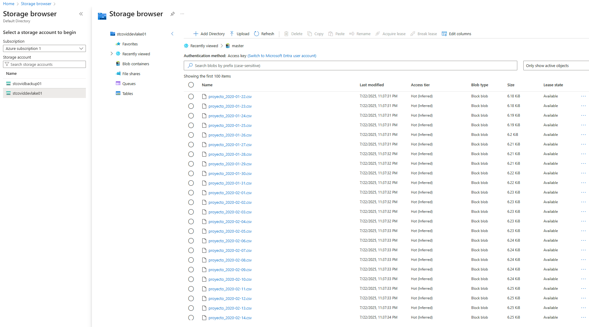
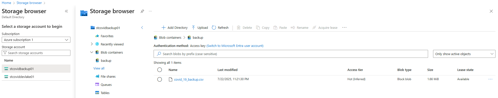
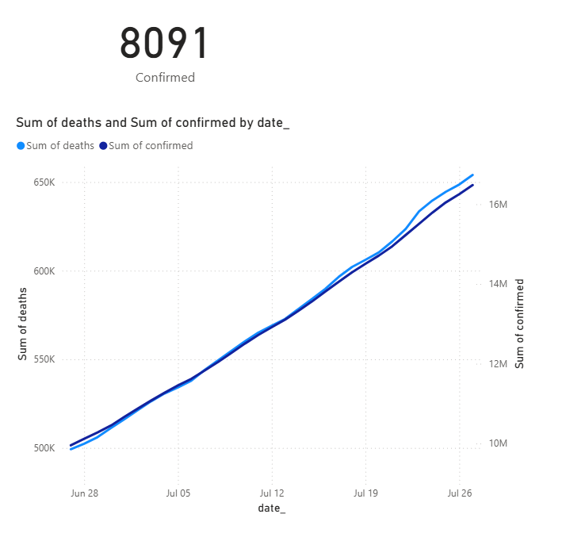
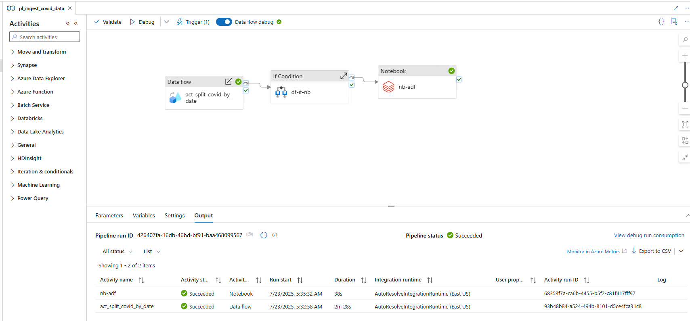

# Proyecto de Ingesta y Análisis de Datos COVID-19

Este proyecto implementa una arquitectura moderna de ingesta, procesamiento y visualización de datos COVID-19 usando Azure Data Factory (ADF), Azure Databricks y Power BI.

---

## Parte 1: Automatización con ADF

### Objetivo
Descargar, transformar y almacenar datos COVID-19 desde Kaggle, generando archivos diarios separados por fecha y un respaldo mensual consolidado.

### Recursos utilizados
- Azure Data Factory: `adf-covid-dev`
- Storage Account: `stcoviddevlake01`
- Contenedores:
  - `raw`: Descarga original
  - `master`: Archivos CSV por fecha (proyecto_yyyy-MM-dd.csv)
  - `backup`: Consolidado mensual (covid_19_backup.csv)

### Pipelines
1. `pl_ingest_covid_data`: Lee datos de Kaggle y escribe en `master/` usando `Data Flow` para separar por fecha.
2. `pl_backup_covid_master`: Consolida todos los CSV de `master/` en un solo archivo mensual en `backup/`.

### Triggers
| Nombre                | Frecuencia | Pipeline                |
|----------------------|------------|--------------------------|
| `daily_split_by_date`| Diario     | `pl_ingest_covid_data`  |
| `monthly_backup`     | Mensual    | `pl_backup_covid_master`|

---

## Master


## Backup


---

## Parte 2: Procesamiento con Azure Databricks

### Objetivo
Cargar los CSV diarios desde `master/`, convertirlos en tabla Delta Lake en `analytics/`, y exportar solo los últimos 30 días para visualización en Power BI.

### Estructura de carpetas
```
/mnt/master/*.csv             <- Datos diarios desde ADF
/mnt/analytics/delta/covid19 <- Tabla Delta particionada por date_
/mnt/analytics/pbi/covid19_csv <- Exportación para Power BI (ultimos 30 días)
```

---

## Orquestación con Azure Data Factory

### Pipeline `pl_full_covid_pipeline`
```plaintext
+-----------------------+
| Data Flow             | → Raw a Master (CSV diarios)
+-----------------------+
        ↓ success
+-----------------------+
| Notebook (Databricks) | → Master a Delta (Analytics) y PBI
+-----------------------+
```

- Trigger diario a las 09:00 AM
- Condición opcional: solo ejecutar el notebook si se cargó al menos 1 archivo

---

## Visualización en Power BI

- Conexión directa desde Power BI Desktop usando Storage Account (`/pbi/covid19_csv`)
- Se utiliza archivo CSV generado en Databricks (ultimos 30 días)
- Gráfico recomendado: **Gráfico de columnas por fecha** mostrando cantidad de casos


---

## Diagrama de Arquitectura



              ┌──────────────────────────────┐
              │ Azure Data Factory (ADF)     │
              │ Pipeline: pl_ingest_covid    │
              └────────────┬─────────────────┘
                           │
                           ▼
         ┌──────────────────────────────────────────┐
         │      Raw Layer (Blob Storage - raw)      │
         │   Contenedor: raw                        │
         │   Ej: covid_19_raw.csv                   │
         └────────────┬─────────────────────────────┘
                      │
                      ▼
              ┌──────────────────────────────┐
              │ Data Flow en ADF             │
              │ df_split_by_date             │
              │ - Divide por fecha           │
              │ - Nombra archivo por fecha   │
              └────────────┬─────────────────┘
                           │
                           ▼
         ┌──────────────────────────────────────────┐
         │   Master Layer (Blob Storage - master)   │
         │   Ej: proyecto_2025-07-22.csv            │
         └────────────┬─────────────────────────────┘
                      │
                      ▼
        ┌────────────────────────────────────────────┐
        │   Azure Databricks                         │
        │   Notebook ejecutado desde ADF             │
        │   Lógica:                                  │
        │   - Monta /mnt/master y /mnt/analytics     │
        │   - Lee CSVs nuevos desde master           │
        │   - Inserta incrementalmente en Delta Lake │
        │   - Exporta últimos 30 días a carpeta PBI  │
        └────────────┬───────────────────────────────┘
                     │
                     ▼
      ┌──────────────────────────────────────────────┐
      │ Delta Table (Blob Storage - analytics)       │
      │ /mnt/analytics/delta/covid19/                │
      └──────────────────────────────────────────────┘
                     │
                     ▼
      ┌──────────────────────────────────────────────┐
      │ Power BI                                     │
      │ Fuente: CSV exportado (últimos 30 días)      │
      │ Path: /mnt/analytics/pbi/covid19_csv/        │
      │ Visualización: Conteo por fechas             │
      └──────────────────────────────────────────────┘
